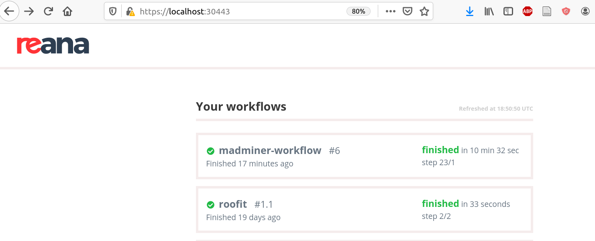

# Execution commands


## Local deployment
The local deployment makes reference to the use of Yadage as the execution coordinator.

Both the complete workflow as well as the sub-workflow repositories have a `Makefile` that defines a few high-level commands for convenience. The main command that it exposes is the `yadage-run` command:

```bash
make yadage-run
```

This command would run the specified workflow within the `workflow` folder, generating a set of results within the .yadage folder (invisible folder only accessible via terminal or IDE).

``` bash
cd .yadage
ls -l
```

## Remote deployment

This section describes executing the workflow on a REANA instance running on a remote cluster. 

The `Makefile` in the complete workflow repository also defines a high-level command for submitting the job to a REANA cluster (the sub-workflows do not). 
However, one must first set some environment variables  in order for the `reana-client` CLI to be able to connect with a REANA instance:

```bash 
# Optional. Only if a virtual env was created
source ~/.virtualenvs/reana/bin/activate

export REANA_ACCESS_TOKEN=“<your access token here>”
export REANA_SERVER_URL=“<the REANA instance URL here>”
export REANA_WORKON=madminer-workflow
```

To determine if the connection is established check the following output

```bash
reana-client ping
```
```
REANA server: <REANA_URL_SERVER>
REANA server version: 0.7.1
REANA client version: 0.7.2
Authenticated as: <username> <username@institution>
Status: Connected
```

<!--
There is, however, a shortcut in the case that the REANA instance has been installed locally in the same computer where the workflow has been cloned. Only in those cases, users could use the reana-dev CLI tool to automatically set up some environment variables for them.

```bash
# Mandatory, as REANA was installed locally
source ~/.virtualenvs/reana/bin/activate

eval $(reana-dev client-setup-environment)
export REANA_WORKON=madminer-workflow
```
-->

Finally, and on the same terminal window, run:

```bash
make reana-run
```

You should see an output similar to this 

```
Copying sub-workflows...
Deploying on REANA...
madminer-workflow.1
File /ph/input.yml was successfully uploaded.
File /ph/yadage/steps.yml was successfully uploaded.
File /ph/yadage/workflow.yml was successfully uploaded.
File /ml/input.yml was successfully uploaded.
File /ml/yadage/steps.yml was successfully uploaded.
File /ml/yadage/workflow.yml was successfully uploaded.
File /workflow.yml was successfully uploaded.
madminer-workflow has been queued
```

## Local monitoring of remote workflows

If we have access to a remote REANA server instance, it is more helpful to monitor the workflows and retrieve output files from the local browser than from the working directory at the cluster’s institution.  Here are the steps to do it:


```bash
#local terminal, ssh to the institution hosting the REANA server
ssh -q -L <port>:<REANA_SERVER_URL>:<port> <username>@<institution>
#if the previous command brings you to a bastion, go ahead and login to your workspace
```

In the case of Brookhaven National Lab, the REANA server is located at
```
REANA_SERVER_URL=”https://kubmaster01.sdcc.bnl.gov:30443” (port=30443)
REANA_ACCESS_TOKEN contact with admin
```

You can now check the progress of your workflows in `https://localhost:<port>` on your local browser and download output files. Congratulations!

## Example screenshots

The list of REANA workflows that have been submitted and their status:



The specification for one of the workflows:


The files produced in the workflow and stored in the workflow's workspace


You can access individual files either from the web interface or with the `reana-client` CLI


You can also directly view some files, like this plot:


You can also inspect the logs for different steps in the workflow (eg. generate and plotting below)


And if you have an MLFlow tracking server runnning, you can view the metrics and artifacts being tracked


